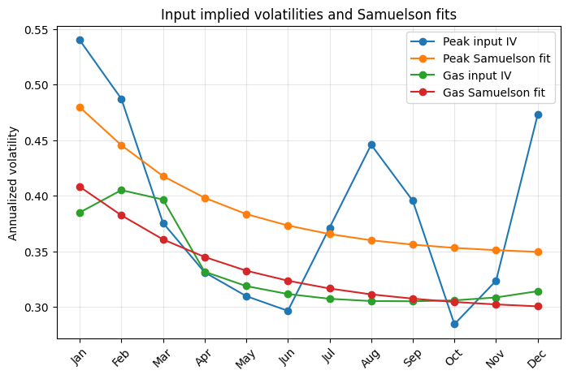
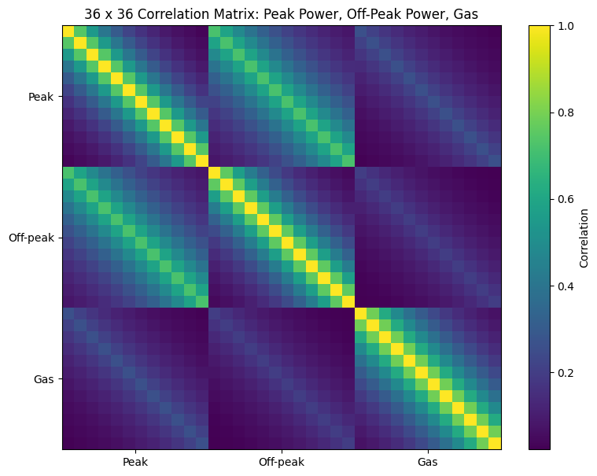
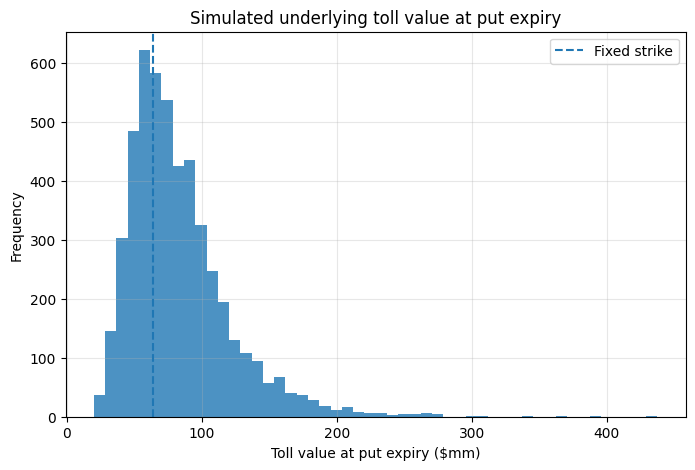
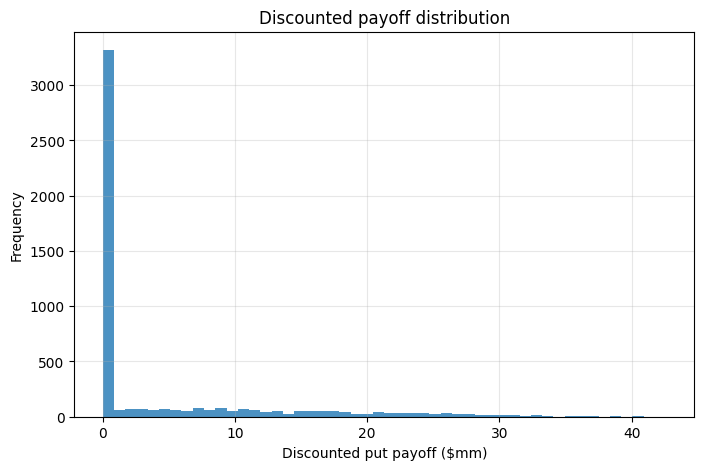
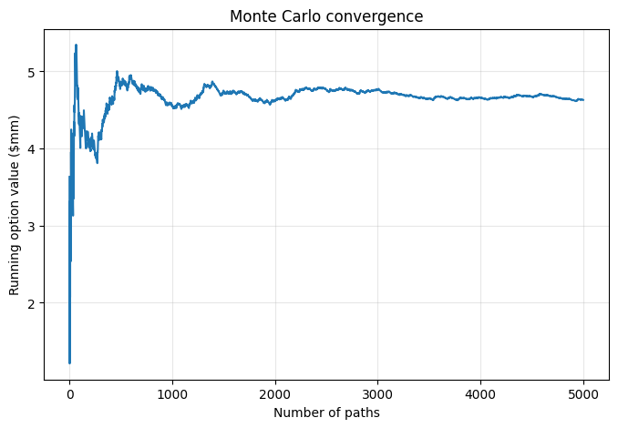
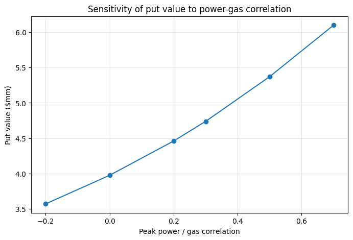
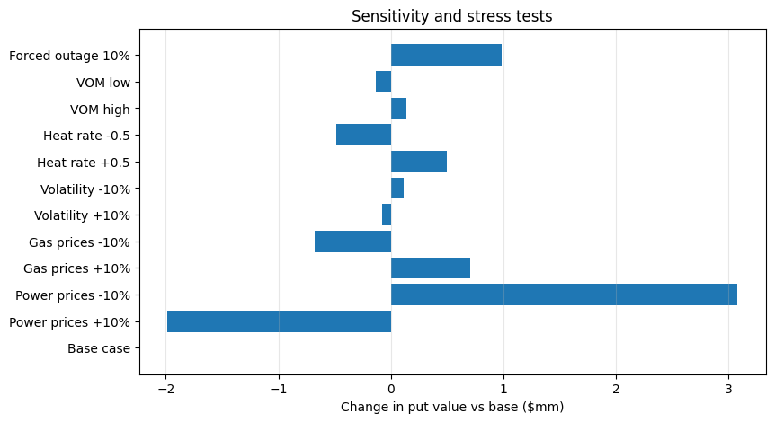
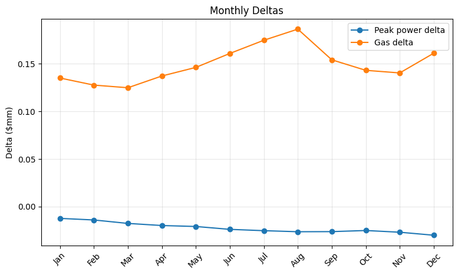
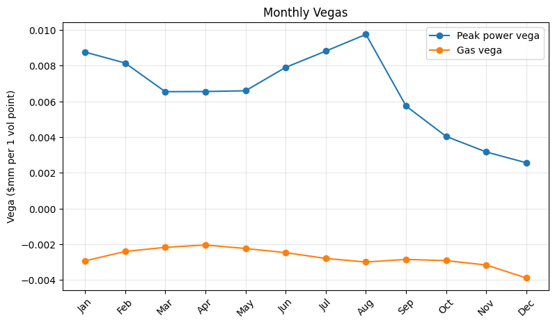

# Power Plant Tolling Put Valuation Showcase

## Overview

This public repository summarizes an energy-derivatives valuation project for a fixed-strike put option on a natural-gas-fired power plant's tolling value.

The full Excel-calibrated notebook and course data are kept private. This showcase version presents the project idea, modeling improvements, selected output figures, and interpretation of results.

## Project Idea

The option provides downside protection on the plant's 2027 tolling value. The plant earns value from the spark spread:

```text
Power Price - Heat Rate × Gas Price - Variable O&M
```

The fixed-strike put payoff is:

```text
max(K - V_toll, 0)
```

where `V_toll` is the simulated total tolling value at the put expiry date.

## Improved Modeling Framework

The original version directly simulated annual spark-spread revenue. After feedback, I improved the project into a two-stage valuation framework:

1. simulate forward power and natural gas prices to the put expiry date;
2. at expiry, value the remaining monthly plant tolls using Kirk-style spread-option logic;
3. compute the put payoff on the total tolling value;
4. discount the expected payoff back to the valuation date.

## Main Improvements

This improved version adds:

- Black-76 implied volatility calibration for power options;
- natural gas implied volatility extraction from the options sheet;
- Samuelson-style volatility fitting for both power and gas;
- variance mapping between simulation variance and residual pricing variance;
- correlated Monte Carlo simulation of forward prices at put expiry;
- Kirk-style monthly spread-option valuation;
- explicit 36-dimensional correlation structure;
- power-gas correlation sensitivity analysis;
- monthly Delta and Vega estimates.

## Key Results

The improved model estimated a base underlying toll value of approximately **$80.0 million** at the put expiry date.

The fixed strike was set to 80% of this value, or approximately **$64.0 million**.

The estimated present value of the put was approximately **$4.63 million**, with an exercise probability of about **34.9%**.

The Monte Carlo standard error was approximately **$0.118 million**, giving a 95% confidence interval of approximately **$4.40 million to $4.86 million**.

## Selected Figures

### Samuelson Volatility Fits



### Correlation Heatmap



### Simulated Toll Value Distribution



### Discounted Payoff Distribution



### Monte Carlo Convergence



### Power-Gas Correlation Sensitivity



### Sensitivity and Stress Tests



### Monthly Deltas



### Monthly Vegas



## Interpretation

The put value increases when the plant's tolling value becomes more vulnerable. Lower power prices, higher gas prices, worse heat rate, and higher forced outages increase the value of downside protection.

The power Delta is negative because higher power prices increase the plant's tolling value, making the put less valuable. The gas Delta is positive because higher gas prices reduce spark spreads and make the put more valuable.

Power-gas correlation materially affects the option value, so correlation should be treated as a key model input rather than ignored.

## Important Limitations

This is an educational valuation model, not a production trading model.

Several assumptions remain simplified:

- off-peak power forwards are approximated from peak forwards;
- off-peak volatility is approximated from peak volatility;
- dispatch is simplified and does not fully model unit commitment;
- the correlation structure is partly assumption-based;
- Samuelson calibration can produce high short-maturity parameters, so the fitted curves should be interpreted as a variance-mapping framework rather than exact market quotes.

## Private Code and Data Notice

This public version contains selected summaries and output figures only. The full Excel-calibrated notebook and original Excel input file are kept private because the project was originally based on course-provided materials.

## Skills Demonstrated

- Python
- Energy derivatives
- Black-76 implied volatility
- Samuelson volatility modeling
- Monte Carlo simulation
- Kirk spread-option approximation
- Power and natural gas forward modeling
- Sensitivity analysis
- Delta and Vega risk estimation
